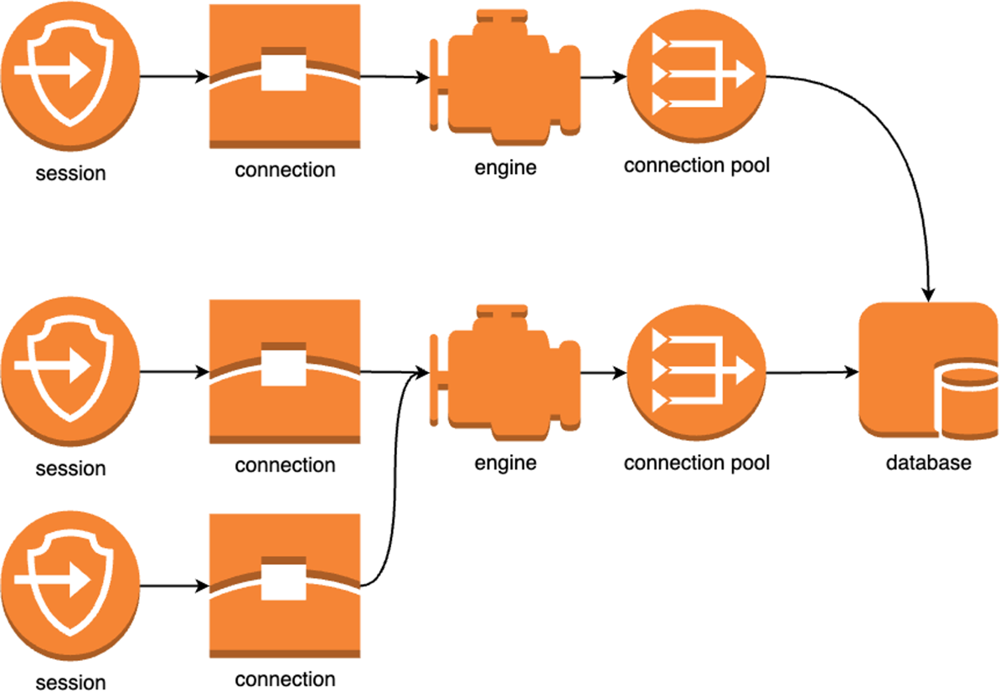

# The problem that the library solves

Sqlalchemy has an engine that is responsible for the connection pool.
The engine must be alive all the time the application is running in order to
quickly issue ready connections to the application when it needs it.

We use sessions in the application.
The session receives one connection from the pool. The session should live a
short time, at most for the processing time of one request, and often even
less.



Let's see what existing solutions are available to manage engine and session:

### Manual solution

This is how the code is duplicated and that two connections and two
transactions
are used. And often in this case, one connection and one transaction
were needed:

```python
@app.post("/users/")
async def create_user(name):
    await insert_user(name)
    await insert_user_profile(name)


async def insert_user(name):
    async with get_async_session() as session:
        async with session.begin():
            await session.execute(stmt)


async def insert_user_profile(name):
    async with get_async_session() as session:
        async with session.begin():
            await session.execute(stmt)
```

You can move the duplicate code to a higher level, and then you get one
connection and a transaction:

```python
@app.post("/users/")
async def create_user(name:):
    async with get_async_session() as session:
        async with session.begin():
            await insert_user(name, session)
            await insert_user_profile(name, session)


async def insert_user(name, session):
    await session.execute(stmt)


async def insert_user_profile(name, session):
    await session.execute(stmt)
```

But if you look at it globally, the code duplication doesn't go away.
You need to do this in every handler:

```python
@app.post("/dogs/")
async def create_dog(name):
    async with get_async_session() as session:
        async with session.begin():
            ...


@app.post("/cats")
async def create_cat(name):
    async with get_async_session() as session:
        async with session.begin():
            ...
```

You also have to set up everything yourself.
No ready-made integration solutions are used. On the one hand, freedom,
on the other hand, a lot of code.

### Dependency

You can use dependency. For example, in fatsapi it looks like this:

```python
async def get_atomic_session():
    async with session_maker() as session:
        async with session.begin():
            yield session


@app.post("/dogs/")
async def create_dog(name, session=Depends(get_atomic_session)):
    ...


@app.post("/cats/")
async def create_cat(name, session=Depends(get_atomic_session)):
    ...
```

There are 2 problems here:

- You cannot close the session and transaction prematurely, because the
  dependency is responsible for this
- The session will have to be rolled from the very top of the stack down to
  the point where it is really needed

By the way, there is no ready-made solution for integration into the framework
here. Write the dependency itself yourself

### Wrappers over sqlalachemy

There are various wrappers that often have more convenient integration

Litestar, for example, has the advantages and disadvantages of dependency:

```python
config = SQLAlchemyAsyncConfig(
    connection_string=URL
)

sqlalchemy_plugin = SQLAlchemyInitPlugin(config)


class UserRepository(SQLAlchemyAsyncRepository[User]):
    model_type = User


@post("/users")
async def create_user(data: User, repo: UserRepository):
    await repo.add(data)  # <- insert into User
```

here is an example of ormar:

```python
class BaseMeta(ormar.ModelMeta):
    ...


class User(ormar.Model):
    ...


@app.post("/users/")
async def create_user(name):
    await User.objects.create(name=name)
```

The main problem with wrappers is that it's new knowledge that the developer
needs to know. This is a new syntax. If a developer knows sqlalchemy
they don't necessarily know the wrapper.

Wrappers are also often conveniently designed with simple CRUD scripts,
but complex SQL queries are very difficult to write.

### Solution

And the library solves all this:

- Very convenient integration with web frameworks
- Automatic engine, session and transaction lifecycle management
- You can close the session manually without waiting for automation
- Getting a session out of context only where it is needed